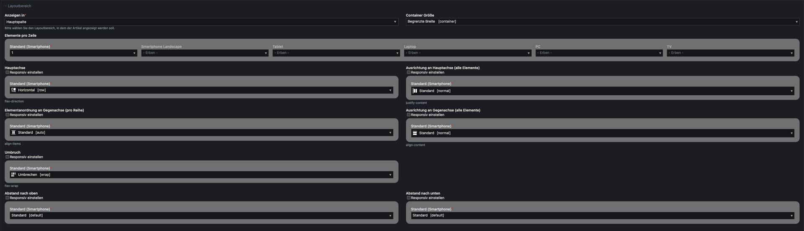
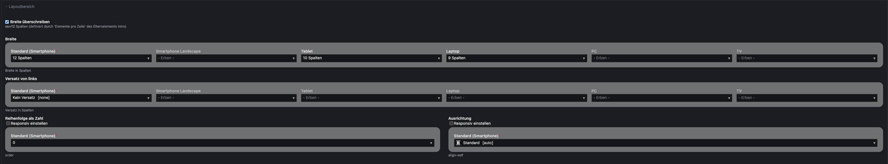
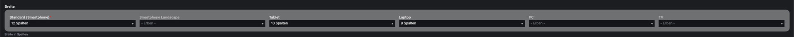
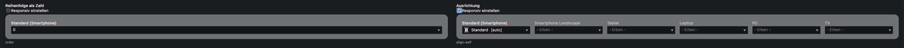

# KIWI. Contao Bootstrap

**Implement the Bootstrap CSS framework into your Contao CMS.**

## Table of contents
1. [Scope](#scope)
2. [Setup](#setup)
   1. [Installation](#installation)
   2. [Implementation](#implementation)
      1. [Themes](#theme)
      2. [Layouts](#layout)
      3. [Wrapping elements: articles, element groups & modules of type list](#article)
      4. [Elements: content elements, form fields & modules](#element)
   3. [Gutters, spacings and gaps](#spacing)
   4. [Widgets](#widget)

## Scope <a name="scope"></a>

This bundle allows you to define bootstrap layout properties within your Contao backend.

Define **container widths and flex properties** for wrapping elements:
- articles (tl_article)
- element groups (tl_content)
- fieldsets (tl_form_field)
- forms (tl_form)
- sections (tl_layout)

Set **colspans and flex properties** for components:
- content elements (tl_content)
- form fields (tl_form_field)
- modules and their list items (tl_module)

Create responsive fields yourself by using the integrated **ResponsiveWidget** or **OptionalResponsiveWidget**.


## Setup <a name="setup"></a>

### Installation <a name="installation"></a>
Install the bundle via composer
 ```sh
composer require kiwi/contao-bootstrap-bundle
 ```

#### Configuration
Some options can be configured via .env variables:
```dotenv
# Controls which spacing keys appear in the BE dropdowns and the generated SCSS.
# unset / 0  → only the new spacer-based keys (implicit default — will be migrated to 1 if deprecated values are still in use)
#         1  → only the deprecated keys (legacy default)
#         2  → both sets (for legacy projects mid-migration)
#         3  → only the new spacer-based keys (explicit opt-in — the migration
#              will not touch this even when stored deprecated values exist)
KIWI_BOOTSTRAP_DEPRECATED_SPACINGS=1
```

### Implementation <a name="implementation"></a>
**Step 1: (Re-)store themes <a name="theme"></a>**

Go to themes (<em>/contao?do=themes</em>) and create or edit a theme. Choose those bootstrap components that shall be loaded or chose none to load all – in any case you need to restore the theme so that some theme files can be generated.

---

**Step 2: (Re-)store layouts  <a name="layout"></a>**

Afterwards you go to layouts (<em>/contao?do=themes&table=tl_layout&id={{theme_id}}</em>) and create or edit one. Apply container widths to row sections (header, footer), custom sections (by choosing a correspondig template) and sidebars (main area will fill available space). If you don't want to manually load Bootstrap you can activate automatic loading in your CSS-framework selection (recommended).

CSS-Classes and their styles will now be applied, when you define bootstrap layout properties in your contents (forms, modules, articles & content elements)

---

**Step 3: Use in articles, content element_groups and modules listing elements<a name="article"></a>**

Articles are used as bootstrap containers.
- **Container Width**: You can choose between container-fluid (whole viewport) and limited width upwards a specifix breakpoint.
- **Elements per row**: Defines how many content elements will be shown in one row.
- **Direction** [flex-diretion]: Define block (vertical and horizontal) and inline alignment.
- **Alignment** [justify-content, align-content, align-items]: Define block (vertical and horizontal) and inline alignment.
- **Wrapping** [flex-wrap]: Allow or disallow row breaks.
- **Spacing** [padding-top, padding-bottom]: Choose how much distance an article should have to its previous and next sibling [(Take a look at the spacing section for further information)](#spacing).


To define further **content elements** as wrapper, you can add an entry to `$GLOBALS['responsive']['tl_content']['includePalettes']['container']` within your config file. 

To define further **modules** as wrapper, you can add an entry to `$GLOBALS['responsive']['tl_module']['includePalettes']['container']` within your config file.


---

**Step 4: Use in content elements, form fields and modules<a name="element"></a>**
- **Overwrite Width**: Check to overwrite "Elements per row" setting of parent element.
- **Width**: Set elements width.
- **Offset**: Define the positioning of the element.
- **Order**: Change the order of an element.
- **Alignment**: Overwrite "Alignment" setting of parent element.


To remove the settings from a specific **content element**, add an entry to `$GLOBALS['responsive']['tl_content']['excludePalettes']['column']` within your config file. 

To remove the settings from a specific **module**, add an entry to `$GLOBALS['responsive']['tl_module']['excludePalettes']['column']` within your config file. 

To remove the settings from a specific **form field**, add an entry to `$GLOBALS['responsive']['tl_form_field']['excludePalettes']['column']` within your config file. 


### Gutters, spacings and gaps <a name="spacing"></a>
Horizontal and vertical distances between articles and elements are based on Bootstrap's $spacers. You can modify and add values via `$modify-spacers`, or completely customize the available options by overwriting `$spacers`.

#### Configuring the default top/bottom spacing

`responsiveSpacingTop` and `responsiveSpacingBottom` can be customized without writing a custom configuration class, set `$GLOBALS['responsive']['spacingDefault']` in `contao/config/config.php`. Three input shapes are accepted:

```php
// Scalar — applies symmetrically to top and bottom at the xs breakpoint
$GLOBALS['responsive']['spacingDefault'] = 6;

// Asymmetric — different value per side, still at xs
$GLOBALS['responsive']['spacingDefault'] = ['top' => 6, 'bottom' => 4];

// Full control — per-breakpoint arrays per side
$GLOBALS['responsive']['spacingDefault'] = [
    'top'    => ['xs' => 4, 'lg' => 6],
    'bottom' => ['xs' => 6],
];
```

Each leaf value must be a key of `$arrSpacings` (e.g. `0`–`10`, `none`, `noop`); an invalid key throws `InvalidArgumentException` at construction time. Clear the cache after editing the value.

#### Configuring the default container outer padding

The container outer padding (`cx-*`) field defaults to `cx-2` on new records. You can change this without writing a custom configuration class by setting `$GLOBALS['responsive']['containerPaddingXDefault']` in `contao/config/config.php`. The same three input shapes are accepted; the side keys are `main` (content elements, articles and form fields), `header` and `footer` (the layout section containers):

```php
// Scalar — applies to main, header and footer at the xs breakpoint
$GLOBALS['responsive']['containerPaddingXDefault'] = 3;

// Per side, still at xs — clear header/footer back to opt-in, keep the main default
$GLOBALS['responsive']['containerPaddingXDefault'] = ['header' => [], 'footer' => []];

// Full control — per-breakpoint arrays per side
$GLOBALS['responsive']['containerPaddingXDefault'] = [
    'main' => ['xs' => 2, 'lg' => 4],
];
```

Each leaf value must be a key of `$arrContainerPaddingXClasses` (`0`–`10`); an invalid key throws `InvalidArgumentException` at construction time. Pass an empty array for a side to clear its default (no preselected value). Clear the cache after editing the value.

#### Legacy spacings (deprecated)

The named options `default`, `none`, `gap`, `gap-half`, `xxs`, `xs`, `sm`, `md`, `lg`, `xl` and `xxl` are deprecated in favour of the numeric spacer scale (`0`–`10`) and will be removed in a future major release. Existing installations that still rely on them can re-enable the legacy set via `KIWI_BOOTSTRAP_DEPRECATED_SPACINGS`.

For simple customization, you can overwrite the following variables in you (s)css file
```css
:root {
  --spacing-default: your_size;
  --spacing-none: your_size; /* "0" recommended */
  --spacing-gap: your_size; /* grid gutter width recommended */
  --spacing-gap-half: your_size; /* half of grid gutter width recommended */
  --spacing-xxs: your_size;
  --spacing-xs: your_size;
  --spacing-sm: your_size;
  --spacing-md: your_size;
  --spacing-lg: your_size;
  --spacing-xl: your_size;
  --spacing-xxl: your_size;
}
```

### Widgets <a name="widget"></a>
There a different types of responsive widgets allowing you to adjust a setting for different viewports (Values will be inherited from smaller to bigger device).
When using them, define the input type that shall be replicated as 'responsiveInputType'. 

**Fully Responsive Widget** [responsive]

Directly shows a setting for every viewport


Example usage:
```php
$GLOBALS['TL_DCA'][{your table}]['fields'][{your first field}}] = [
    'inputType' => 'responsive',
    'responsiveInputType' => 'select',
    'options_callback' => [{your first options}, {your second option}}],
    'sql' => "blob NULL"
];
```

---

**Optionally Responsive Widget** [optionalResponsive]

Only shows a global setting but can be set responsively by activating the checkbox.


Example usage:
```php
$GLOBALS['TL_DCA'][{your table}]['fields'][{your second field}}] = [
    'inputType' => 'optionalResponsive',
    'responsiveInputType' => 'text',
    'sql' => "blob NULL"
];
```
